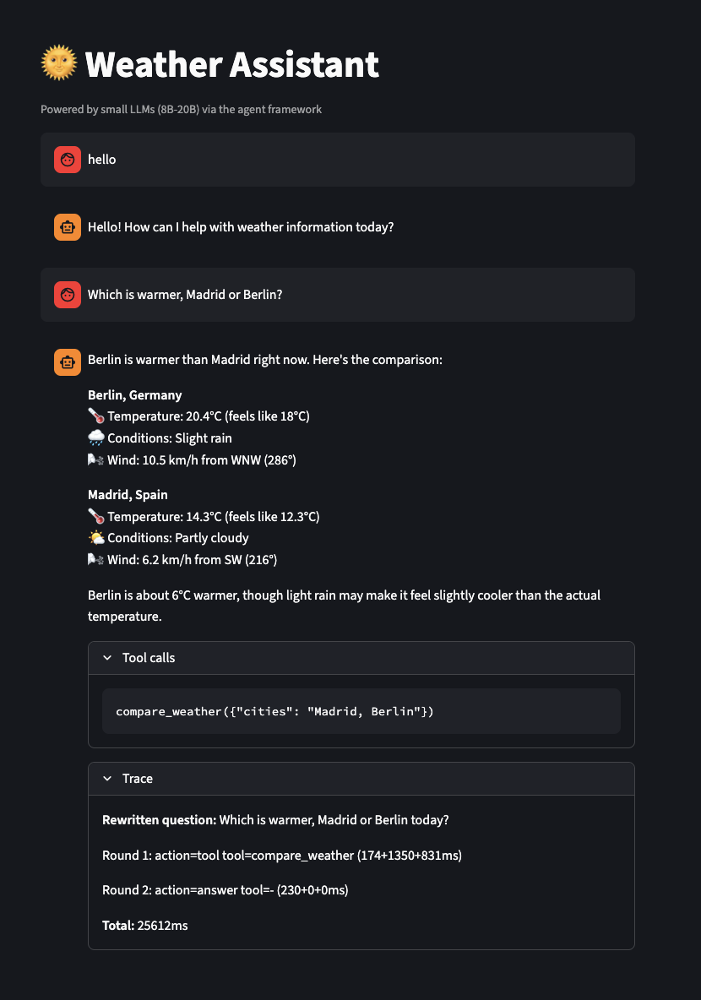
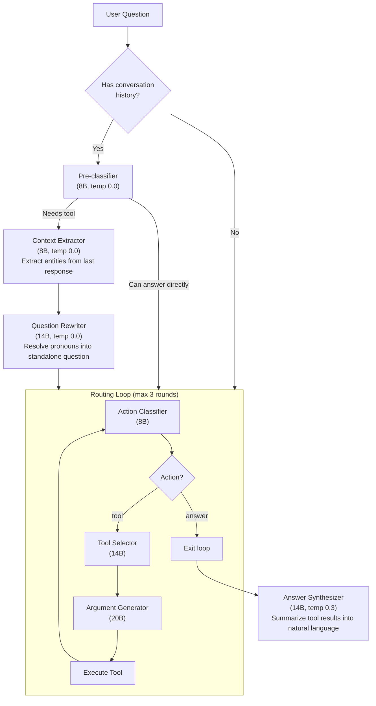

# Weather Assistant

A weather Q&A agent built with the **Agent Framework** — a reusable pipeline for building tool-calling LLM assistants that work reliably with small, self-hosted models (8B-20B parameters). Use this if you want to build an assistant that runs on your own hardware without depending on frontier API providers — or go hybrid, mixing local models for simple stages and a frontier API for the ones too complex for a small model.



## The Idea

Large frontier models (GPT-4, Claude) can do tool selection, argument generation, and answer synthesis in a single prompt. Small open-source models (8B-20B parameters) can't — they struggle when you ask them to do multiple things at once. A single prompt that says *"read this conversation, figure out what the user means, pick the right tool, generate the arguments, and write a helpful answer"* will fail unpredictably with a 14B model.

The framework solves this by **decomposing the problem into small, focused tasks** — each simple enough for a small model to handle reliably:

1. **Action classifier** — "Should I call a tool or answer directly?" (binary JSON decision)
2. **Tool selector** — "Which tool?" (pick from a catalog)
3. **Argument generator** — "What arguments?" (fill a JSON schema)
4. **Answer synthesizer** — "Summarize the data into a natural response"

Each stage gets a narrow instruction, minimal context, and a constrained output format. This turns an unreliable single-shot approach into a reliable multi-step pipeline where each step is nearly deterministic.

### Hybrid by Design

The framework is **not just for small models**. It's designed to be hybrid:

- **Small open-source models** (Granite 8B, Qwen3 14B, Mistral, etc.) benefit from the decomposition — each stage is a simple, focused task they handle well
- **Frontier models** (GPT-4, Claude, Gemini) work through the same pipeline but with higher accuracy at each stage — the structure doesn't hurt them and the explicit routing gives you observability, guardrails, and cost control you wouldn't get with a single-pass approach
- **Mix and match** — use a small model for fast classification (8B), a medium model for tool selection (14B), and a larger model for answer quality (20B+). Each stage can use a different model via environment variables. You can even mix providers — run a local 8B for classification (fast, free, private) and route argument generation or answer synthesis to a frontier API like Claude (accurate, pay only where it matters)

The pipeline structure gives you benefits regardless of model size: structured tracing, hallucination guards, explicit tool routing, and predictable behavior you can test and debug.

## Architecture

```
weather-assistant/
├── framework/              # Reusable agent framework (model-agnostic)
│   ├── runner.py           # Main orchestrator (rewrite → route → answer)
│   ├── pipeline/           # Routing loop, rewriter, guards, parsing
│   ├── clients/            # LLM clients (Ollama, OpenAI-compatible, Vertex AI)
│   └── tools/              # Tool registry and execution
├── weather_assistant/      # This agent's implementation
│   ├── tools/weather.py    # Weather tools (Open-Meteo API)
│   ├── prompts/            # Stage-specific prompts
│   ├── entities.py         # City entities for routing
│   ├── pipeline_config.py  # Wires prompts + models into the framework
│   └── main.py             # FastAPI app
└── app.py                  # Streamlit chat UI
```

The framework provides the pipeline structure. The weather assistant provides the domain knowledge (tools, prompts, entities). Adding a new agent means writing a new set of tools and prompts — the routing, parsing, guards, and streaming infrastructure is reused.

## Pipeline Flow



## How to Run

### 1. Create a virtual environment and install dependencies

```bash
cd weather-assistant
python3 -m venv .venv
source .venv/bin/activate
pip install -r requirements.txt
```

### 2. Configure your LLM

Edit `weather_assistant/.env` to point to your LLM provider. Default config uses Ollama:

```env
LLM_PROVIDER=ollama
LLM_BASE_URL=http://localhost:11434/v1
LLM_MODEL=qwen3:14b
```

You can also use any OpenAI-compatible endpoint (vLLM, llama.cpp, etc.) by setting `LLM_PROVIDER=openai` and providing `LLM_API_KEY`.

### 3. Start the agent backend

```bash
source .venv/bin/activate
python -m weather_assistant.main
```

The API runs on `http://localhost:8002`. Test it:

```bash
curl -X POST http://localhost:8002/weather/chat \
  -H 'Content-Type: application/json' \
  -d '{"message": "What is the weather in Tokyo?"}'
```

### 4. Start the Streamlit UI (optional)

In a second terminal:

```bash
cd weather-assistant
source .venv/bin/activate
streamlit run app.py
```

Opens a chat interface at `http://localhost:8501` with tool call visibility and pipeline tracing.

### 5. Run tests

```bash
source .venv/bin/activate
pytest tests/ -v
```

## Tools

| Tool | Description | API |
|------|-------------|-----|
| `get_current_weather(city)` | Current temperature, humidity, wind, conditions | Open-Meteo |
| `get_forecast(city, days)` | Daily forecast for 1-7 days | Open-Meteo |
| `compare_weather(cities)` | Compare current weather across multiple cities | Open-Meteo |

All tools use the [Open-Meteo API](https://open-meteo.com/) — free, no API key needed.

## Model Configuration

Each pipeline stage can use a different model. Set via environment variables in `.env`:

| Variable | Stage | Recommended |
|----------|-------|-------------|
| `LLM_MODEL_CLASSIFIER` | Action classifier | Small (8B) — binary decision |
| `LLM_MODEL_EXTRACTOR` | Context extractor | Small (8B) — simple JSON extraction |
| `LLM_MODEL_TOOL_SELECTOR` | Tool selector | Medium (14B) — pick from catalog |
| `LLM_MODEL_TOOL_ARGUMENTS` | Argument generator | Medium-Large (14B-20B) — schema filling |
| `LLM_MODEL_REWRITER` | Question rewriter | Medium (14B) — needs nuance |
| `LLM_MODEL_ANSWER` | Answer synthesizer | Medium+ (14B+) — natural language |

All fall back to `LLM_MODEL` if unset.

### `agent.yaml`

Pipeline behavior and per-stage model settings are defined in `weather_assistant/agent.yaml`:

```yaml
llm:
  timeout: 300          # seconds per LLM call
  max_retries: 2        # retry on transient failures

pipeline:
  max_tool_rounds: 3    # max tool calls before forcing an answer
  max_tool_result_chars: 2000  # truncate large tool outputs

models:
  classifier:           # action classifier — "tool" or "answer"
    model: ${LLM_MODEL_CLASSIFIER}
    temperature: 0.0
    max_tokens: 1024
  tool_selector:        # which tool to call
    model: ${LLM_MODEL_TOOL_SELECTOR}
    temperature: 0.0
    max_tokens: 1024
  tool_arguments:       # generate tool arguments (JSON)
    model: ${LLM_MODEL_TOOL_ARGUMENTS}
    temperature: 0.0
    max_tokens: 1024
  answer:               # synthesize final response
    model: ${LLM_MODEL_ANSWER}
    temperature: 0.3    # slight creativity for natural language
    max_tokens: 4096
  rewriter:             # rewrite follow-up questions
    model: ${LLM_MODEL_REWRITER}
    temperature: 0.0
    max_tokens: 1024
  extractor:            # extract entities from conversation context
    model: ${LLM_MODEL_EXTRACTOR}
    temperature: 0.0
    max_tokens: 256
```

The `${LLM_MODEL_*}` references are resolved from environment variables (`.env`). Each stage can point to a different model — use a small model for classification (fast, cheap) and a larger model for answer synthesis (better quality).

## Tradeoffs

The multi-step pipeline adds latency (5-25s per question on a local GPU) compared to a single LLM call. This is a deliberate tradeoff: small self-hosted models (8B-20B) fail unpredictably at single-shot tool calling, and the decomposition makes them reliable. If you have access to frontier models and don't need self-hosting, a single-pass approach is simpler and faster.

## Building Your Own Agent

The framework is designed to be copied and reused. To build a new agent:

1. **Copy `framework/`** into your project
2. **Write your tools** — decorate with `@register_tool`, add examples with `register_examples()`
3. **Write your prompts** — one module per stage (action, tool_selector, tool_arguments, answer, rewriter)
4. **Create `agent.yaml`** — model config per stage
5. **Wire it up** — `pipeline_config.py` + `main.py` + `routers/chat.py`

The framework handles routing, parsing, streaming, hallucination guards, question rewriting, and structured tracing. You provide the domain knowledge.
